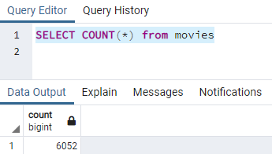
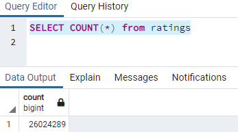

# Movies-ETL Analysis for the Hack-a-Thon

## Overview and Purpose
For this analysis, we were tasked with creating an automatic pipeline that takes in new data, performs the appropriate transformations and loads the data into existing tables in a SQL database by refactoring existing code and creating a function that executes a majority of the program. Specifically, we were asked to complete the following deliverables:
    - Deliverable 1: Write an ETL Function to Read Three Data Files
    - Deliverable 2: Extract and Transform the Wikipedia Data
    - Deliverable 3: Extract and Transform the Kaggle data
    - Deliverable 4: Create the Movie Database 

## Results
We were able to complete the task with minimal issues. We were able to merge data sets and successfully uploaded our tables to the database with the correct number of data points

